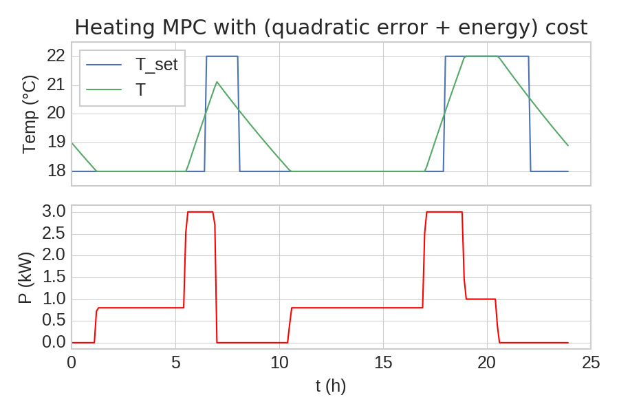

# dmpc

Project adress: https://github.com/pierre-haessig/python-dmpc

## Purpose

`dmpc` is simulation tool for Model Predictive Control (MPC) and Distributed MPC,
written in pure Python.

As of now, it is in a very early stage, meaning that only a few subset of features
are implemented (one type of MPC). However, what is implemented should work well enough
and be covered by a resonable set of [tests](./dmpc/tests).

## Installation

Beyond the usual stack of scientific Python packages (in fact only `numpy`),
`dmpc` requires the optimization package `cvxopt` (http://cvxopt.org/)
to solve linear or quadratic optimization problems.

To install `dmpc` directly from the source tree:

    pip install git+git://github.com/pierre-haessig/python-dmpc.git

or clone the repository first and then run:

    pip install .

## Examples

Some [examples](./examples) are provided in the source tree.

As of now, only a heating example with a quadratic cost for the temperature
deviations is implemented.

